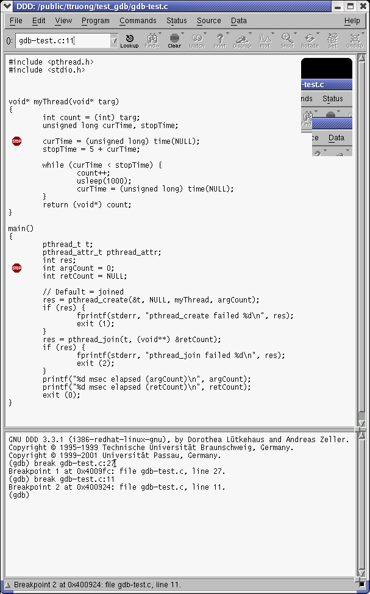

= Broadcom Application Note -- Using the cross debugger
Broadcom Corporation <support@broadcom.com>
v1.0, 2015-04-20: Converted to asciidoc.

:toc:

== Introduction

A cross debugger is delivered with the toolchain.  There is a version
for Little Endian (mipsel-linux-gdb) and a version for Big Endian
(mips-linux-gdb).  These tools run on the host PC.  We have verified
that the debugger run fine in RedHat 7.3, Fedora Core 3 and RedHat
Enterprise 3 in both endians.

The default rootfs for each STB image includes gdbserver, which allows
the host-side debugger to remotely debug binaries on the target.
Please note that gdbserver is released under GPLv3, which means it MAY
NOT be included on production set-top boxes if security is enabled.

== Using the debugger

=== Prepare

On the PC host, make sure that you have the following items:

 * A copy of the uClibc libraries.  This can come either
 ** from your own rootfs build, if you have customized the uClibc configuration
 ** from the tarball nfsroot-xxxx.tar.bz2 that comes with the release
 ** If you don't have any of the above, simply boot the initrd kernel,
    then replicate the directory /lib onto the Host side (either by
    NFS mount & write, or through USB keys).

Let's assume that you place the libraries in this directory:
`/opt/mybuild/rootfs/lib`

[Optional] Edit the file ~/.gdbinit (in your home directory) to include the following commands:
----
  set solib-absolute-prefix /opt/mybuild/rootfs
  set solib-search-path /opt/mybuild/rootfs/lib
----
This will allow gdb to recall your search path everytime it is run.

Note that

. the uClibc libraries must reside in a directory named 'lib'.
. the value for solib-absolute-prefix points to the parent directory,
  whereas the value for solib-search-path must include the lib
  subdirectory.
. It is important that the values of solib-search-path and
  solib-absolute-prefix point to a replica of the /lib directory from
  the STB, and its parent directory respectively, and not to the
  toolchain or any other directories.
. The sollib-search-path syntax follows the usual path syntax,
  i.e.multiple segments can be entered with the colon (:) as separator.

=== Set up target gdbserver

On the STB, do the following
----
# ifconfig eth0
----
and record the STB IP address.  Then `cd` to the directory containing
your app `gdb_test2` and run
----
# gdbserver foo:6789 gdb-test-d
----
gdb-test-d is the dynamically linked pthreaded apps from the tarball
mentioned above.

gdbserver is the server side of gdb, and is delivered as part of the
root filesystem.

foo is just a place holder, you can use any string.

6789 is the port number, and you can use any port number above 1000.

=== Connect with host gdb

On the host PC, with mipsel-linux-gdb from the toolchain
----
$ cd <dir from (1) above>/gdb_test2
$ mipsel-linux-gdb gdb-test-d
----

this will also read the file `~/.gdbinit`.

Now make sure that your solib- search paths are correct.

----
gdb> show solib-absolute-prefix
gdb> show solib-search-path
----

if they don't match in (1) above, simply type in the following
commands.  The search paths have the usual path syntax, i.e. multiple
path segments can be separated by colons.  Brackets denote optional
entries.
----
gdb> set solib-absolute-prefix <your path to uClibc libdir __without__ the lib subdir>[:<your app private solib path>]
gdb> set solib-search-path <your path to uClibc libdir __with__ lib subdir>[ : <your app private solib if any>]
----

Attach the debugger to gdbserver on the STB
----
gdb> target remote <STB_IP_ADDR>:6789
----

List source file
----
gdb> list 1,50
----

Set breakpoint:
----
gdb> b 22  (break point #1 at start of main routine)
gdb> b  11  (break point #2 inside thread)
gdb> cont
----
Note: Use cont instead of run.

This will start the app and then breaks at bp #1.
----
gdb> where
----

This displays the stack trace
----
gdb> cont
----

This will continue the run, then breaks at bp #2.

Notice that there is a message informing that the focus of gdb has
been switched to the new thread.  This is the sign that gdb is working
correctly on threaded apps.
----
gdb> info thread
----

This list the threads currently active
----
gdb> thread 1
----

This switches the thread focus to thread #1 (the main thread)
----
gdb> thread 2
----

This switches gdb thread focus to the child thread #2.
----
gdb> cont
----

The program will run, then exit normally
----
gdb> quit
----

== Using ddd

ddd provides a GUI interface around gdb.  If you have an X server
running on your PC host, you can invoke ddd as follows:
----
$ ddd --gdb --debugger "mipsel-linux-gdb <your_app>"
----
A screenshot of a ddd debugging session follows:

== Native gdb

A native gdb binary may optionally be generated as part of the build
process.  This is done by using a variant of the standard build
target:

Normal 7405b0 build: `make images-7405b0 install`

Special 7405b0 build with native gdb: `make images-7405b0-gdb install`

gdb can be invoked the same way as it is used on a PC, e.g.
----
# gdb /path/to/application
----

There is a little more computing overhead involved in using the native
gdb, but it is easier to set up.
